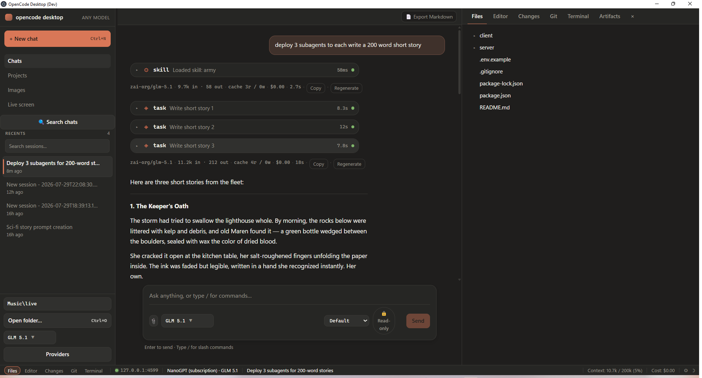
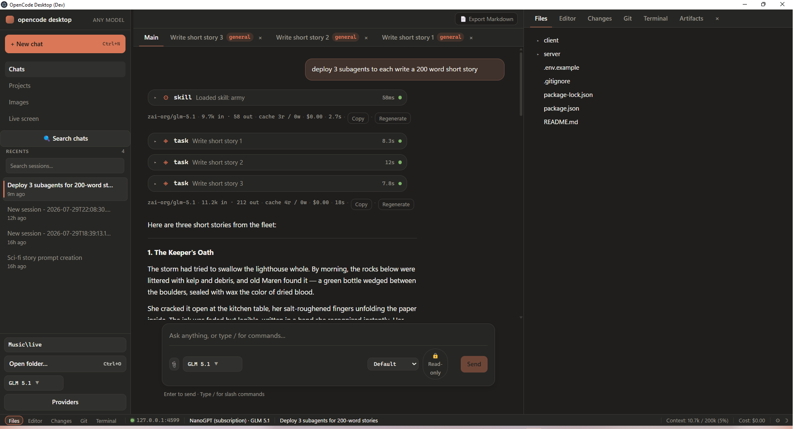
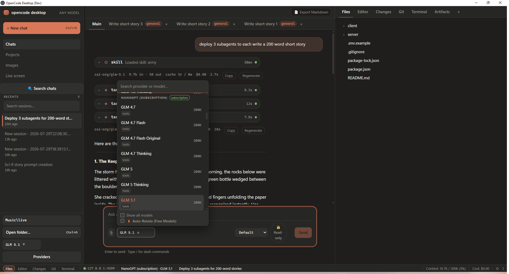
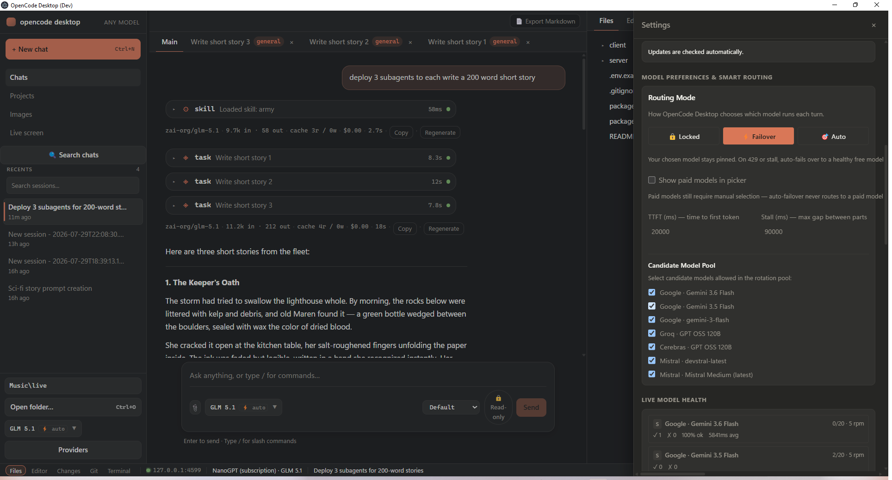
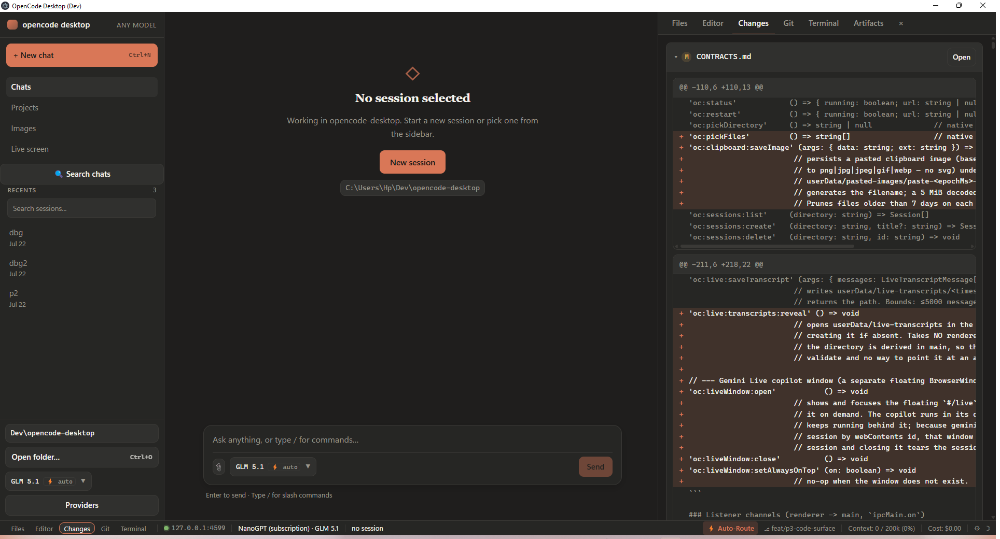

# OpenCode Desktop

A Claude-Code-style desktop GUI for coding agents — backed by [OpenCode](https://opencode.ai)
instead of a single vendor's API.

The chat surface, streaming tool calls, permission prompts and session history all look and
behave like a modern agentic coding client, but the engine underneath is `opencode serve`.
That means **any** provider OpenCode supports: Groq, Google Gemini, OpenRouter, Cerebras,
Mistral, local Ollama, and so on. There is no Anthropic dependency anywhere in the app — the
model picker is populated entirely from whatever providers you have authenticated.



---

## ELI5 — what is this thing?

**It's a desktop app where an AI does the typing, and you stay in charge.**

You open one of your code folders, tell the AI what you want in plain English, and it goes and
does it — reads your files, edits them, runs commands in a terminal, checks the results. You
watch the whole thing happen live and approve anything risky before it runs.

**The part that makes it different: it isn't tied to one AI company.**

Most tools like this only talk to one company's AI, and you pay that company. This one talks to
whichever AI you point it at — Google's Gemini, Groq, Mistral, Cerebras, OpenRouter, or a model
running on your own machine. Several of those have free tiers, and the app is built around that:
if the free model you're using hits its rate limit mid-task, the app notices and switches to
another healthy free one instead of dying.

**How the pieces fit together**

Think of it as three things stacked up:

| Piece | Plain English | The technical name |
|---|---|---|
| The window you look at | Buttons, chat bubbles, the file tree, the diff view | The Electron/React renderer |
| The bit that does real work | Actually touches your files, runs git, opens terminals, holds your API keys | The Electron main process |
| The brain | Decides what to do next and calls the AI | The `opencode` CLI, running in the background |

The window can't touch your files directly. Everything it wants to do has to be asked for through
a single locked-down doorway, and the middle layer checks each request — is this path actually
inside the project folder? is this file too big? Doing it this way means a bug in the pretty part
can't wreck your disk.

**What you actually see when you use it**

- A **chat** on the left, where the AI's work streams in as it happens — every file it reads,
  every command it runs, shown as a card you can expand.
- A **panel** on the right that flips between your file tree, a code editor, the diff of what
  changed, a git view, and a real terminal.
- An **approval prompt** any time the AI wants to do something that touches your machine, unless
  you've told it that particular thing is fine.
- A **model picker** at the bottom, so you can swap which AI is driving at any point — even
  halfway through a conversation.

**Is it going to break my code?**

It can edit files, so work in a git repo and commit before you turn it loose. Two guardrails are
built in and can't be switched off: the app will **never** `git push` and never force-anything
(pushing is a decision you make yourself, in your own terminal), and it can only read and write
inside the folder you opened.

**Do I need to pay for an AI subscription?**

No. Free API keys from Groq, Google AI Studio, or OpenRouter are enough to use it properly. See
[Adding free provider keys](#adding-free-provider-keys) below.

---

## Screenshots

**Subagent tabs.** When the agent delegates work with the `task` tool, each child gets its own
real session — and its own tab. You can watch any of them without losing your place in the main
conversation.



**Any provider, one picker.** Models are grouped by provider, searchable, and annotated with
context length and capabilities. Free providers sort first; paid ones are hidden until you ask
for them, and auto-failover will never route to one.



**Smart routing, and it shows its working.** Pick how much freedom the app has — `Locked` runs
exactly what you chose, `Failover` keeps your pick but switches to a healthy free model on a 429
or a stall, `Auto` picks the healthiest model each turn. The live health table underneath is real
telemetry: requests used against each model's published cap, success rate, average latency.



**A review surface, not an IDE.** The right-hand panel carries the file tree, a Monaco editor
with per-hunk accept/reject, the working-tree diff, a git panel, and a real terminal pinned to
the project directory. Shown here reviewing this repository's own uncommitted changes.



---

## Download

Pre-built Windows installers are published on the
[GitHub Releases](https://github.com/bosscube1/OPENCCODE/releases) page:

- `OpenCode Desktop-<version>-setup.exe` — NSIS installer (per-user, desktop + start-menu
  shortcuts)
- `OpenCode Desktop-<version>-portable.exe` — portable build, no installation needed

Installed copies auto-update via `electron-updater` from the release feed.

---

## Architecture

```
┌────────────────────────┐   IPC    ┌───────────────────────┐   HTTP + SSE   ┌──────────────────┐
│  renderer (React 19)   │ ───────► │  main (Electron 43)   │ ─────────────► │  opencode serve  │
│  zustand store, chat   │ ◄─────── │  owns SDK + child     │ ◄───────────── │  (child process) │
└────────────────────────┘  events  └───────────────────────┘   event stream └──────────────────┘
```

- **Main process owns everything stateful.** It spawns `opencode serve` as a child process,
  holds the only `@opencode-ai/sdk` client, and subscribes exactly once to the server's SSE
  event stream.
- **The renderer never speaks HTTP.** A `file://` origin cannot make cross-origin requests to
  a loopback server without tripping CORS, so all traffic is funnelled over `ipcRenderer.invoke`
  through a `contextBridge` API (`window.api`). The renderer imports SDK **types only**.
- **Events are rebroadcast verbatim.** Every SSE event the main process receives is forwarded
  to the renderer on the `oc:event` channel; a single reducer in the zustand store folds them
  into UI state (message parts stream in token by token, tool calls transition
  `pending → running → completed`, permission requests appear as prompts).
- **The OpenCode server is torn down with the app.** Quitting kills the child process, so no
  orphaned server is left holding the port.

Renderer hardening: `contextIsolation: true`, `nodeIntegration: false`, plus a restrictive CSP
in `src/renderer/index.html`.

### Layout

```
src/
  main/       Electron main process — server lifecycle, SDK client, IPC handlers
  preload/    contextBridge definition of window.api  (+ index.d.ts for the renderer)
  renderer/
    index.html
    src/
      main.tsx        React entry
      App.tsx         shell
      index.css       design tokens + app/sidebar styles
      components/     Chat, MessageView, ToolCall, Composer, PermissionPrompt, Sidebar, ...
      lib/            store.ts (zustand), types.ts
electron.vite.config.ts
electron-builder.yml
```

---

## Prerequisites

| Requirement | Notes |
|---|---|
| **Node.js 20.19+ or 22.12+** | electron-vite 5 requires it. `node -v` |
| **OpenCode CLI** | `npm i -g opencode-ai` — then check with `opencode --version` |
| **Windows 10/11** | The build targets Windows first; the app spawns `opencode.cmd`. |

The app looks for `opencode` on your `PATH`. If `npm i -g` put it somewhere unusual, make sure
that directory is on `PATH` before launching (`where opencode` should print a path ending in
`opencode.cmd`).

---

## Adding free provider keys

**Keys never live in this repo.** There is no `.env` to fill in and no key field in the UI.
Authentication is delegated to the OpenCode CLI, which writes credentials to its own store
(`%USERPROFILE%\.local\share\opencode\auth.json`). That file is outside the project directory
and is not something this app reads or writes.

Run this once per provider, in any terminal:

```powershell
opencode auth login
```

Pick a provider from the list and paste the key. Good free-tier options:

| Provider | Where to get a key | Free-tier highlights |
|---|---|---|
| **Groq** | <https://console.groq.com/keys> | `llama-3.3-70b-versatile`, `openai/gpt-oss-120b` — extremely fast |
| **Google Gemini** | <https://aistudio.google.com/apikey> | `gemini-2.5-flash`, `gemini-2.5-pro` — large context |
| **OpenRouter** | <https://openrouter.ai/keys> | every `:free` model, e.g. `qwen/qwen3-coder:free` |

Then restart the app (or hit **Reconnect** in the title bar) and the new provider's models
appear in the picker.

If you would rather configure providers declaratively — pin a default model, restrict the
picker to specific models, give the `plan` and `build` agents different models — copy
[`opencode.json.example`](./opencode.json.example) to `opencode.json` in your project folder
and edit it. It uses `{env:GROQ_API_KEY}`-style references, never literal keys. `opencode.json`
is gitignored.

---

## Scripts

```powershell
npm install          # first time only

npm run dev          # electron-vite dev — Vite HMR for the renderer, hot restart for main
npm run typecheck    # tsc over both projects (node + web); must be clean before a PR
npm run test         # vitest unit tests (main services + renderer helpers/slices)
npm run lint         # ESLint; 0 errors required
npm run build        # production bundle into out/
npm run dist:win     # build + package the Windows NSIS installer and portable .exe into dist/
```

- `npm run dev` starts the Vite dev server on `http://127.0.0.1:5173` and opens the Electron
  window against it. The OpenCode server is started by the main process, not by you.
- `npm run typecheck` runs two passes — `tsconfig.node.json` (config file, `src/main`,
  `src/preload`) and `tsconfig.web.json` (`src/renderer/src`) — both with `--composite false`
  so nothing is emitted.
- `npm run dist:win` runs `electron-builder --win`, producing the NSIS installer
  (`OpenCode Desktop-<version>-setup.exe`), the portable build
  (`OpenCode Desktop-<version>-portable.exe`), and the auto-update feed (`latest.yml`)
  under `dist/`. For a quick unpacked build without the installers, use
  `npm run dist:win:dir`, which produces `dist/win-unpacked`.

---

## Troubleshooting

### "Port already in use" / the app starts but never connects

The main process binds `opencode serve` to `127.0.0.1:4599`. If something else already owns
that port — usually a previous run of this app or a stray `opencode serve` from a terminal —
the server fails to start and the title bar shows a red disconnected state.

```powershell
netstat -ano | Select-String ":4599"      # find the PID in the last column
Stop-Process -Id <PID>                    # then hit Reconnect in the app
```

### Provider authentication errors

Symptom: the session starts, then immediately errors with a 401/403 or "no such model".

1. Confirm the provider is actually authenticated: `opencode auth list`.
2. Re-run `opencode auth login` for that provider — free-tier keys are often rotated or
   rate-limited rather than invalid, and a 429 surfaces the same way in the UI.
3. If you use `opencode.json`, check the model id is one the provider really serves. A typo in
   a model id fails at request time, not at startup. `opencode models` lists valid ids.
4. Free tiers have per-minute request and token caps. If long sessions die partway through,
   you are probably hitting a rate limit — switch to a second free provider in the picker.

### Orphaned `opencode serve` process

If Electron is killed hard (Task Manager, a crash during `npm run dev`), the child server can
survive and keep the port.

```powershell
Get-CimInstance Win32_Process |
  Where-Object { $_.CommandLine -like "*opencode*serve*" } |
  Select-Object ProcessId, CommandLine

Stop-Process -Id <PID>
```

Then restart the app. The main process reaps its child on `will-quit`, so this should only
happen after an abnormal exit.

### `opencode` is not recognised

The app spawns `opencode.cmd`, which only exists after a global install. Run
`npm i -g opencode-ai`, close and reopen your terminal (so the updated `PATH` is picked up),
verify with `where opencode`, then relaunch the app.

### Blank window after `npm run dev`

Usually a renderer exception. Open DevTools (`Ctrl+Shift+I`) and check the console. If the
error is a CSP violation, the dev server is likely running on a non-loopback host — the CSP in
`src/renderer/index.html` only whitelists `127.0.0.1` and `localhost`.

---

## License

MIT.
